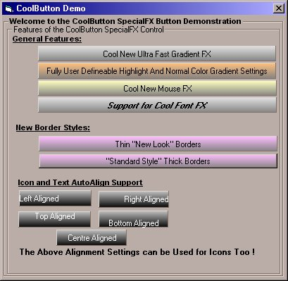



## Dynamic SpecialFX Buttons For VB

### Description

Make eye catching GUI interfaces with this easy to use CommandButton replacement, and Make your project stand apart from the rest. With a host of new gradient color,icon and highlight effects, this control will no doubt enhance your App's UI !
 
### More Info
 

             |
---                |---
**Submitted On**   |2002-04-04 06:46:10
**By**             |[Srideep Prasad](https://github.com/Planet-Source-Code/PSCIndex/blob/master/ByAuthor/srideep-prasad.md)
**Level**          |Advanced
**User Rating**    |4.7 (223 globes from 47 users)
**Compatibility**  |VB 4\.0 \(32\-bit\), VB 5\.0, VB 6\.0
**Category**       |[Custom Controls/ Forms/  Menus](https://github.com/Planet-Source-Code/PSCIndex/blob/master/ByCategory/custom-controls-forms-menus__1-4.md)
**World**          |[Visual Basic](https://github.com/Planet-Source-Code/PSCIndex/blob/master/ByWorld/visual-basic.md)
**Archive File**   |[Dynamic\_Sp68452432002\.zip](https://github.com/Planet-Source-Code/srideep-prasad-dynamic-specialfx-buttons-for-vb__1-33388/archive/master.zip)

